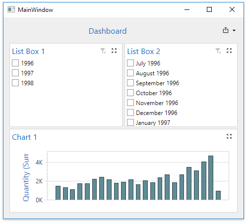

<!-- default badges list -->

<!-- default badges end -->
<!-- default file list -->
*Files to look at*:

* [MainWindow.xaml](./CS/Wpf_NeutralFilterMode_Example/Wpf_NeutralFilterMode_Example/MainWindow.xaml)
<!-- default file list end -->

# Dashboard for WPF - Neutral Filter Mode

This example demonstrates the [neutral filter mode](https://docs.devexpress.com/Dashboard/400262) in WPF Dashboard Viewer.

## Documentation

- [Manage Interactivity Capabilities](https://docs.devexpress.com/Dashboard/400011/wpf-viewer/manage-interactivity-capabilities)
- [Neutral Filter Mode](https://docs.devexpress.com/Dashboard/400262/common-features/interactivity/neutral-filter-mode)

## More Examples

- [Dashboard for WPF - How to Set Master Filter in the DashboardControl](https://github.com/DevExpress-Examples/wpf-dashboard-how-to-set-master-filter)
<!-- feedback -->
## Does this example address your development requirements/objectives?

 

(you will be redirected to DevExpress.com to submit your response)
<!-- feedback end -->
